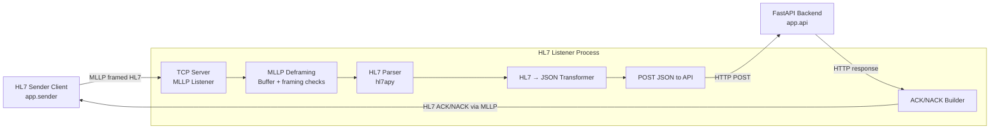

# Lyrebird HL7 Integration


A minimal HL7 v2.x integration service using TCP/MLLP.  
It receives HL7 messages, parses them, transforms them to JSON, forwards them to a REST API, and returns HL7-compliant ACK/NACK responses.

---

## TL;DR – Quick Start

### Option 1: Run with Docker (Recommended)
```sh
# 1. Ensure Docker Desktop or Docker Engine and Docker Compose are installed and running
# 2. Build and start all services
docker compose up --build
```
In a separate terminal:
```sh
# 3. Create a virtual environment (if you havent already)
python3 -m venv venv

# 4. Activate virtual environment
source venv/bin/activate 

# 5. Install requirements (in venv)
pip install -r requirements.txt

# 6. Send an HL7 message
python3 -m app.sender
```

Expected sender output:
```sh
Received ACK message:
MSH|^~\&|ReceivingApp|ReceivingFacility|SendingApp|SendingFacility|20260304213451||ACK|edf37cf0-f8e8-44ff-a416-bb07f517f315|P|2.3
MSA|AA|123456
```
### Option 2: Run Manually (Local Python)
```sh
# 1. Create a virtual environment (if you havent already)
python3 -m venv venv

# 2. Activate virtual environment
source venv/bin/activate 

# 3. Install dependencies (in venv)
pip install -r requirements.txt

# 2. Start FastAPI backend
uvicorn app.api:app --reload

# 3. Start HL7 listener (in new terminal)
source venv/bin/activate 
python3 -m app.listener

# 4. Send an HL7 message (in new terminal)
source venv/bin/activate 
python3 -m app.sender
```

Check API health:
```sh
curl http://localhost:8000/health
# Expected: {"status":"ok"}
```

Expected sender output:
```sh
Received ACK message:
MSH|^~\&|ReceivingApp|ReceivingFacility|SendingApp|SendingFacility|20260304213451||ACK|edf37cf0-f8e8-44ff-a416-bb07f517f315|P|2.3
MSA|AA|123456
```

---

## Project Overview
**Goal**: Demonstrate core healthcare integration concepts:
- HL7 v2 message handling
- MLLP framing over TCP
- ACK/NACK generation
- HL7 → JSON transformation
- Downstream API forwarding

**Architecture Diagram:**


**Flow Summary**
1. TCP listener accepts connection and receives MLLP-framed HL7 messages. 
2. Messages are deframed and parsed with hl7apy. 
3. Parsed messages are transformed into JSON. 
4. JSON payload is POSTed to FastAPI REST API. 
5. Listener returns:
    - AA → Application Accept (success)
    - AE → Application Error (failure)

---

## Features

- **Dockerized Deployment:** Easily run the app and all dependencies in containers.
- **HL7 Listener:** TCP/MLLP server, supports multiple clients via threading. 
- **HL7 Parsing:** Uses [hl7apy](https://github.com/crs4/hl7apy) for  HL7 v2.x parsing.
- **MLLP Framing:** Handles partial/multiple messages per TCP packet. 
- **Robust MLLP Handling:** Supports partial TCP packets, multiple messages per packet, and framing validation.
- **JSON Transformation:** Modular HL7 → JSON transformer.
- **Buffer Size & Framing Error Limits:** Enforces a buffer size limit (default: 1 MB) and limits repeated framing errors (default: 5) to prevent memory exhaustion or protocol abuse.
- **FastAPI Backend:** Example REST API endpoint for processed messages.
- **Idempotency Guard:** Thread-safe in-memory cache to prevent duplicate processing. 
- **Structured Logging:** Logs key metadata (timestamps, message_type, control_id, patient_id).
- **Error Handling:** Returns appropriate HL7 ACK/NACK responses.

---

## Project Structure

```
lyrebird-hl7-integration/
├── app/
│   ├── core/
│   │   ├── ack.py         # HL7 ACK builder
│   │   ├── mllp.py        # MLLP framing/deframing
│   │   └── config.py      # Configuration from .env
│   ├── services/
│   │   └── transformer.py # HL7 → JSON transformer
│   ├── api.py             # FastAPI backend
│   ├── listener.py        # HL7 TCP/MLLP listener
│   └── sender.py          # HL7 sender client
├── examples/
│   └── sample_adt_a01.hl7 # Example HL7 message
├── tests/                 # Unit and integration tests
├── .env                   # Environment configuration
└── README.md
```

---

## Requirements

- Python 3.8+
- [Docker Compose](https://docs.docker.com/compose/) must be installed.
- [Docker Desktop](https://www.docker.com/products/docker-desktop/) or Docker Engine must be running.
- - All Python dependencies are listed in [requirements.txt](requirements.txt) and installed automatically by Docker or with `pip install -r requirements.txt`.

Install dependencies:

```sh
pip install -r requirements.txt
```

---

## Usage

### OPTION A: Running with Docker
You can run the entire app stack using Docker and Docker Compose.

### 1. Build and Start the Services

```sh
docker-compose up --build
```

This will:
- Build the backend image.
- Start the backend service, exposing the configured port (default: 8000).

### 2. Environment Variables

- The app uses a `.env` file for configuration.
- Docker Compose automatically loads environment variables from `.env` using the `env_file` directive.

### 3. Port Mapping

- By default, the backend runs on port 8000 inside the container and is mapped to port 8000 on your host.
- You can change the external port in `docker-compose.yml` if needed:
  ```yaml
  ports:
    - "8000:8000"
  ```
### 4. Send HL7 Messages

Activate virtual environment
```sh
source venv/bin/activate 
```

```sh
python3 -m app.sender
```

Expected sender output:
```sh
Received ACK message:
MSH|^~\&|ReceivingApp|ReceivingFacility|SendingApp|SendingFacility|20260304213451||ACK|edf37cf0-f8e8-44ff-a416-bb07f517f315|P|2.3
MSA|AA|123456
```

### OPTION B: Running Manually

### 1. Start the FastAPI Backend

Create a virtual environment (if you havent already)
```sh
python3 -m venv venv
```

Activate virtual environment
```sh
source venv/bin/activate 
```

Install app dependencies in venv:
```sh
pip install -r requirements.txt  
```

Start the FastAPI Backend
```sh
uvicorn app.api:app --reload
```
Default: http://localhost:8000

or 
```sh
uvicorn app.api:app --port 8000 --log-config logging_config.json
```
for valid JSON output. 


### 2. Health Check 

To verify the API is running and ready for monitoring, use:

```sh
curl http://localhost:8000/health
```
from a separate terminal. 

Expected response:
```json
{"status":"ok"}
```


### 3. Start HL7 Listener

Activate virtual environment
```sh
source venv/bin/activate 
```

```sh
python3 -m app.listener
```

Expected output:
```sh
Listening on 0.0.0.0:2575
```


### 4. Send HL7 Messages

Activate virtual environment
```sh
source venv/bin/activate 
```

```sh
python3 -m app.sender
```

Expected sender output:
```sh
Received ACK message:
MSH|^~\&|ReceivingApp|ReceivingFacility|SendingApp|SendingFacility|20260304213451||ACK|edf37cf0-f8e8-44ff-a416-bb07f517f315|P|2.3
MSA|AA|123456
```

---

### Example HL7 Message

File `examples/sample_adt_a01.hl7`:

```hl7
MSH|^~\&|SendingApp|SendingFacility|ReceivingApp|ReceivingFacility|202603021200||ADT^A01|123456|P|2.3
PID|1||MRN12345||Doe^John||19900101|M|||123 Main St^^City^ST^12345||555-1234
```

---

### Example JSON Output 

Example transformed payload:

```json
{
  "message_type": "ADT^A01",
  "message_control_id": "123456",
  "patient": {
    "mrn": "MRN12345",
    "first_name": "John",
    "last_name": "Doe",
    "dob": "19900101",
    "sex": "M"
  }
}
```

---

## Testing

All tests are located in the `tests/` directory. 

1. Create a virtual environment (if you havent already)
```sh
python3 -m venv venv
```

2. Activate virtual environment
```sh
source venv/bin/activate 
```

3. Run the full suite:
```sh
pytest -v
```

4. Run edge-case tests only:
```sh
pytest -m edge
```

Note: when running tests, make sure app and/or listener isnt being run elsewhere as it will interfere with current CI tests


Testing Highlights:
- **MLLP framing/deframing**
- **ACK/NACK correctness**
- **HL7 → JSON transformation**
- **Integration tests:** full roundtrip (sender → listener → API → ACK)
- **Edge cases:** large messages, malformed HL7, multiple messages in a single TCP packet
- **Concurrency & Idempotency:** multiple simultaneous clients, duplicate message handling

**Skipped tests:**
Some tests for "large HL7 messages" and "too large HL7 messages" are **skipped** by default.  
This is because the HL7 parser (`hl7apy`) enforces field length constraints before the application's message size check, making it impossible to test message size limits with standard HL7 segments.  
These tests are included for documentation and completeness, but will show as `SKIPPED` in the test output:

---

## Secure HL7 Parsing

Incoming HL7 messages are treated as untrusted input and validated defensively before processing.

The listener applies several safeguards:

- **Strict HL7 validation:** Messages are parsed using hl7apy with STRICT validation to enforce HL7 structure and segment requirements.
- **Message type whitelist:** Only supported message types (currently ADT^A01) are accepted.
- **Required field validation:** Critical identifiers such as MSH-10 (message control ID) and PID-3 (patient ID) must be present.
- **Message size limits:** Messages larger than the configured maximum (default: 1 MB) are rejected to prevent memory exhaustion.
- **Graceful error handling:** Invalid or malformed messages are safely rejected and an AE (Application Error) ACK is returned without crashing the listener.

These safeguards help ensure robust handling of malformed or malicious input while maintaining HL7-compliant responses.

---

## Design Decisions

- **Concurrency:** Threaded TCP listener for simultaneous HL7 clients.
- **Idempotency:** In-memory cache; Redis supported for distributed deployments.
- **Streaming & Buffering:** Handles partial/multiple messages per TCP packet.
- **Structured Logging:** Logs timestamps, control_id, message_type, patient_id.
- **Extensibility:** Modular HL7 → JSON transformer for easy segment extension.
- **Validation and defensive parsing:** HL7 input is treated as untrusted external data; therefore strict validation and defensive parsing are applied before transformation or downstream processing.
---

## Limitations

- **Idempotency is in-memory by default:** Will not survive process restarts or scale across multiple containers/instances unless Redis or another shared store is configured.
- **Minimal HL7 segment coverage:** Only core segments (e.g., MSH, PID) are parsed and transformed; additional segments require extension.
- **No TLS support:** All communication is currently unencrypted.
- **No message queue integration:** (e.g., Kafka, RabbitMQ) for downstream processing.
- **Minimal HL7 validation or schema enforcement.**

---

## Future Improvements

- **Persistent/Distributed Idempotency:** Use Redis (with SETNX + TTL) or another shared store for production-grade idempotency across restarts and multiple instances.
- **Full HL7 Segment Support:** Expand parsing and transformation to cover more HL7 segments and fields.
- **TLS/SSL Support:** Add encrypted transport for both listener and API.
- **Message Queue Integration:** Add support for publishing messages to Kafka, RabbitMQ, or similar.
- **Advanced Validation:** Implement stricter HL7 validation and schema enforcement.
- **Enhanced Observability:** Integrate with centralized logging and monitoring solutions (e.g., ELK, Prometheus).
- **Horizontal Scalability:** Support for running multiple listener/API instances behind a load balancer.

---

## Error Handling

- Invalid MLLP framing → AE returned
- HL7 validation or parsing failure → AE returned
- Unsupported message type → AE returned
- Missing required fields → AE returned
- API failure → AE returned
- Successful processing → AA returned

Errors are logged for observability.

---

*See `tests/` for implementation details and expand as needed for your use case!*

---

## License

This project is licensed under the MIT License.  
See the [LICENSE](LICENSE) file for details.

