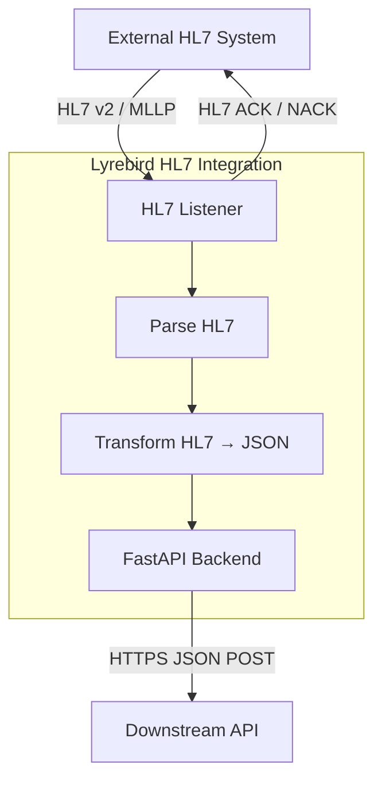
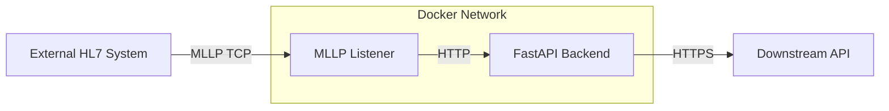

# Lyrebird HL7 Integration


A minimal HL7 v2.x integration service using TCP/MLLP.  
It receives HL7 messages, parses them, transforms them to JSON, forwards them to an HTTPS REST API, and returns HL7-compliant ACK/NACK responses.

---

## TL;DR – Quick Start

Note: all commands to be run from project root

### Run the downstream `stub_api` over HTTPS
**1. Generate certs for REST API stub**
```sh
openssl req -x509 -nodes -days 365 \
  -newkey rsa:2048 \
  -keyout certs/stub.key \
  -out certs/stub.crt \
  -config certs/openssl-stub.cnf
```

**2. Run stub API with TLS**
```sh
# 1. Create a virtual environment (if you haven't already)
python3 -m venv venv

# 2. Activate virtual environment
source venv/bin/activate 

# 3. Install requirements (in venv)
pip install -r requirements.txt

# 4. Run stub API with TLS 
uvicorn app.stub_api:app \
  --host 0.0.0.0 \
  --port 9000 \
  --ssl-keyfile certs/stub.key \
  --ssl-certfile certs/stub.crt
```


### Run backend and listener
**Option 1: Run backend and listener with Docker (Recommended)**
```sh
# 1. Ensure Docker Desktop or Docker Engine and Docker Compose are installed and running
# 2. Starts both the HL7 Listener (on port 2575) and the FastAPI Backend (on port 8000) in separate containers. 
docker compose up --build
```

**Option 2: Run backend and listener Manually (Local Python)**
```sh
# 1. Create a virtual environment (if you havent already)
python3 -m venv venv

# 2. Activate virtual environment
source venv/bin/activate 

# 3. Install dependencies (in venv)
pip install -r requirements.txt

# 4. Start the FastAPI backend (HTTP)
uvicorn app.api:app \
  --host 0.0.0.0 \
  --port 8000 \
  --log-config logging_config.json

# 5. Start HL7 listener (new terminal)
source venv/bin/activate 
python3 -m app.listener
```

### Send HL7 message(s) 
```sh
# In new terminal
source venv/bin/activate 

# Send single message
python3 -m app.sender --file examples/sample_adt_a01.hl7

# Publish every 60 seconds, 10 times 
python3 -m app.sender --schedule 60 --count 10

# Publish indefinitely (Ctrl+C to stop)
python3 -m app.sender --schedule 30

# Publish with custom retry configuration
python3 -m app.sender \
  --file examples/sample_adt_a01.hl7 \
  --host localhost \
  --port 2575 \
  --retries 5 \
  --delay 2.0 \
  --timeout 15
```

Expected sender output:
```sh
Sending message from examples/sample_adt_a01.hl7...
Received ACK message:
MSH|^~\&|ReceivingApp|ReceivingFacility|SendingApp|SendingFacility|20260306200137||ACK|3c3b5c1d-c832-41c8-9b21-adcb2b7ffc94|P|2.3
MSA|AA|123456
```

Expected stub API output:
```sh
Received downstream payload: {'message_type': 'ADT^A01', 'message_control_id': '123456', 'patient': {'mrn': 'MRN12345', 'first_name': 'John', 'last_name': 'Doe', 'dob': '19900101', 'sex': 'M'}, 'source': {'sending_app': 'SendingApp', 'sending_facility': 'SendingFacility'}}
```
Expected log entry in /logs/publisher_audit.jsonl
```jsonl
{"timestamp": "2026-03-09T10:28:38.160581+00:00", "message_control_id": "123456", "attempt": 1, "success": true, "response_time_ms": 63.57, "ack_message": "MSH|^~\\&|ReceivingApp|ReceivingFacility|SendingApp|SendingFacility|20260309102838||ACK|611718e2-26aa..."}
```

Check API health:
```sh
curl http://localhost:8000/health
# Expected: {"status":"ok"}
```

API endpoint used by the listener:
`POST http://localhost:8000/api/v1/messages` - Local/Manual
`POST http://backend:8000/api/v1/messages` - Docker


Downstream API endpoint (stub):
`POST https://localhost:9000/receive` - Local/Manual
`POST https://host.docker.internal:9000/receive` - Docker

---

 ## Smoke Test
From root, run:
```sh
pytest -v tests/smoke_test/
```
- This test suite requires docker to be installed
- The smoke tests validate the end-to-end HL7 flow with minimal setup checks.
- Ensure other backend services have been killed

---

 ## Project Overview
**Goal**: Demonstrate core healthcare integration concepts:
- HL7 v2 message handling
- MLLP framing over TCP
- ACK/NACK generation
- HL7 → JSON transformation
- Downstream API forwarding

**Architecture Diagram:**



**Flow Summary**
1. TCP listener accepts connection and receives MLLP-framed HL7 messages. 
2. Messages are deframed and parsed with hl7apy. 
3. Parsed messages are transformed into JSON. 
4. JSON payload is POSTed to the FastAPI REST API over HTTP. 
5. Backend forwards payload to sample HTTPS downstream stub API.
6. Listener returns:
    - AA → Application Accept (success)
    - AE → Application Error (failure)

---

## Features

- **Dockerized Deployment:** Easily run the app and all dependencies in containers.
- **HL7 Publishing:** HL7 publisher with Single Message Mode and Scheduled Publishing Mode with Custom Retry Configuration and audit trail.
- **HL7 Listener:** TCP/MLLP server, supports multiple clients via threading. 
- **HL7 Parsing:** Uses [hl7apy](https://github.com/crs4/hl7apy) for HL7 v2.x parsing.
- **MLLP Framing:** Handles partial/multiple messages per TCP packet. 
- **Robust MLLP Handling:** Supports partial TCP packets, multiple messages per packet, and framing validation.
- **JSON Transformation:** Modular HL7 → JSON transformer.
- **Buffer Size & Framing Error Limits:** Enforces a buffer size limit (default: 1 MB) and limits repeated framing errors (default: 5) to prevent memory exhaustion or protocol abuse.
- **FastAPI Backend:** Example REST API endpoint for processed messages.
- **Idempotency Guard:** Thread-safe in-memory TTL cache (`cachetools.TTLCache`) to prevent duplicate processing.
  - Atomic check-and-mark via `mark_if_new(control_id)`
  - Auto-expiry via TTL (default: 24h)
  - Bounded cache size (default: 100,000 keys)
- **Structured Logging:** Logs key metadata (timestamps, message_type, control_id, patient_id).
- **Error Handling:** Returns appropriate HL7 ACK/NACK responses.
- **Reliable API Forwarding:** Listener includes exponential backoff retries for backend API calls, configurable retry limits, and comprehensive audit logging for message traceability.


### Key Publisher Features
- **Connection Retries:** Automatically retries failed connections with configurable attempts.
- **Scheduled Publishing:** Simulates real upstream systems with configurable intervals.
- **Dynamic Message Updates:** Automatically updates timestamps and control IDs.
- **Comprehensive Audit Logging:** Tracks every transmission attempt for compliance.
- **Command-line Interface:** Flexible configuration without code changes.

---

## Project Structure

```text
lyrebird-hl7-integration/
├── app/
│   ├── core/
│   │   ├── ack.py         # HL7 ACK/NACK message builder
│   │   ├── mllp.py        # MLLP framing, deframing, and extraction helpers
│   │   ├── config.py      # Centralized environment/config settings
│   │   ├── idempotency.py # Thread-safe TTL idempotency guard
│   │   └── retry.py       # Generic retry utility with exponential backoff
│   ├── services/
│   │   └── transformer.py # HL7 → JSON transformation logic
│   ├── api.py             # FastAPI backend API (receives transformed payloads)
│   ├── listener.py        # HL7 TCP/MLLP listener and ACK generation
│   ├── sender.py          # HL7 sender client/publisher (CLI)
│   └── stub_api.py        # HTTPS downstream stub API for local testing
├── examples/
│   └── sample_adt_a01.hl7 # Example HL7 ADT message
├── logs/
│   └── publisher_audit.jsonl # Publisher audit log (JSONL)
├── certs/
│   ├── openssl-stub.cnf   # OpenSSL config for local stub certificate SANs
│   ├── stub.crt           # Self-signed certificate for stub API TLS
│   └── stub.key           # Private key for stub API TLS
├── tests/
│   ├── unit/              # Unit tests
│   ├── integration/       # Integration tests
│   ├── edge_cases/        # Edge-case and robustness tests
│   └── smoke_test/        # Smoke tests (end-to-end workflow checks)
├── logging_config.json    # Python logging configuration
├── README.md              # Project documentation
├── LICENSE                # MIT license text
├── Dockerfile             # Container image definition
├── docker_compose.yml     # Multi-service local orchestration
├── .env                   # Environment variables
├── pytest.ini             # Pytest configuration
└── requirements.txt       # Python dependencies
```

---

## Requirements

- Python 3.10+
- [Docker Compose](https://docs.docker.com/compose/) must be installed.
- [Docker Desktop](https://www.docker.com/products/docker-desktop/) or Docker Engine must be running.
- All Python dependencies are listed in [requirements.txt](requirements.txt) and installed automatically by Docker or with `pip install -r requirements.txt`.

Install dependencies:

```sh
pip install -r requirements.txt
```

---


## HTTPS Support

This project keeps the internal listener -> backend hop on HTTP, and uses HTTPS for the downstream sample API.

Why `openssl-stub.cnf` is needed:
Modern TLS clients validate the Subject Alternative Name (SAN), not just the certificate Common Name (CN).
If `localhost` and `127.0.0.1` are missing from SAN, HTTPS verification will fail with hostname mismatch errors.

See `openssl-stub.cnf` in the /certs directory content.

---

## Testing

Run all active tests:

```sh
pytest -v
```

### Active Coverage

- **Integration**
  - API accepts valid payloads
  - API rejects missing required MRN
  - API accepts missing optional source
  - Listener processes HL7 and returns ACK
  - FastAPI/downstream JSON contract compatibility (`/receive`)

- **Unit**
  - ACK generation correctness
  - Idempotency behavior
  - Listener retry behavior
  - MLLP frame/deframe and extraction
  - HL7 transform + validation errors

-**Smoke Test Suite**
- This test suite requires docker to be installed
- The smoke tests validate the end-to-end HL7 flow with minimal setup checks.
- **test_01_normal**: verifies core services are reachable and basic send path works.
- **test_02_duplicate**: sends the same message twice; duplicate should be ACKed and logged as skipped.
- **test_03_failure**: with downstream API stopped, a new message should return `AE` and be logged as `nack`.
- **test_04_recovery**: send while downstream is down (`AE`), then resend after recovery (`AA`).
- `logs/publisher_audit.jsonl` is cleared per test for deterministic assertions.

> Notes:
> - Integration runs require listener (`2575`), backend (`8000`), downstream (`9000`).
> - See `tests/` for exact test names.

---

## Security & Input Hardening

- **Strict framing checks:** Only properly framed MLLP messages are processed.
- **Validation first:** Required HL7 fields (e.g., control ID, PID/MRN) are enforced before forwarding.
- **Safe parsing:** Parsing/transform errors return AE and are logged with context.
- **Payload limits:** Message/buffer size limits reduce risk from malformed or oversized input.
- **Transport security boundary:**
  - Listener → backend uses internal HTTP (trusted boundary).
  - Backend → downstream uses HTTPS with CA bundle verification.
- **Operational safeguards:** Retry with exponential backoff for transient failures; idempotency reduces duplicate side effects.

- **Protection scope note:** Beyond the thread-safe idempotency cache, controls include strict MLLP frame validation, buffer/message size limits, required-field validation, defensive parsing, and bounded retry behavior.

---

## Design Decisions

- **Concurrency:** Threaded TCP listener for simultaneous MLLP client connections and async FastAPI handler using non-blocking downstream HTTP calls (`httpx.AsyncClient`).
- **Idempotency:** In-memory cache; Redis supported for distributed deployments.
- **Streaming & Buffering:** Handles partial/multiple messages per TCP packet.
- **Structured Logging:** Logs timestamps, control_id, message_type, patient_id.
- **Extensibility:** Modular HL7 → JSON transformer for easy segment extension.
- **Validation and defensive parsing:** HL7 input is treated as untrusted external data; therefore strict validation and defensive parsing are applied before transformation or downstream processing.
- **Transport Security:** The REST API supports HTTPS using TLS certificates. For local development a self-signed certificate is used, while production deployments should use trusted certificates.
 - **Reliability vs. Latency Trade-off:** The listener uses exponential backoff retries for API forwarding rather than failing fast, prioritizing message delivery guarantee over immediate response latency.

---

## Limitations

- **Idempotency is in-memory by default:** Uses local process memory (`TTLCache`), so entries do not survive restarts and are not shared across instances/containers without Redis (or similar shared store).
- **MLLP framing assumption:** Current MLLP handling assumes standard framing bytes only: start block `0x0B` (VT), end block `0x1C` (FS), followed by `0x0D` (CR). Non-standard framing variants are not supported without code changes.
- **Minimal HL7 segment coverage:** Only core segments (e.g., MSH, PID) are parsed and transformed; additional segments require extension.
- **Self-signed TLS certificates are used for local HTTPS support:** In production, use certificates from a trusted CA.
- **No message queue integration:** (e.g., Kafka) for downstream processing.
- **Minimal HL7 validation/schema enforcement:** Core-field validation exists; full schema-level validation is not implemented.
- **Potential single point of failure:** If the listener crashes, inbound messages can be lost.
- **No strict ordering guarantee:** Concurrent processing does not ensure global order.
- **Message durability gap:** If process failure occurs before downstream completion, messages may be lost.

---

## Future Improvements

- **Persistent/Distributed Idempotency:** Use Redis (with SETNX + TTL) or another shared store for production-grade idempotency across restarts and multiple instances.
- **Full HL7 Segment Support:** Expand parsing and transformation to cover more HL7 segments and fields.
- **TLS/SSL Support:** Add encrypted transport for internal listener -> FastAPI backend hop. 
- **Message Queue Integration:** for high-throughput environments (eg: Kafka). Helps with buffering, horizontal scaling and backpressure.
- **Advanced Validation:** Implement stricter HL7 validation and schema enforcement.
- **Enhanced Observability:** Integrate with centralized logging and monitoring solutionsl
- **Horizontal Scalability:** Support for running multiple listener/API instances behind a load balancer.
- **Dead Letter Queue:** Store messages that fail all retry attempts for manual review or automated reprocessing.
- **Circuit Breaker:** Prevent repeated retry attempts when downstream API is confirmed offline
- **Guarantee message ordering:** serialize messages by routing by sending facility, queue partitioning, sequence validation. 
---

## Error Handling

- Invalid MLLP framing → **AE**
- HL7 parse/validation failure → **AE**
- Downstream/API forwarding failure after retries → **AE**
- Successful processing and forwarding → **AA**
- All failures/successes are logged with message context for traceability.

---

*See `tests/` for implementation details and expand as needed for your use case!*

---

## License

This project is licensed under the MIT License.  
See the [LICENSE](LICENSE) file for details.

