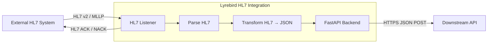

# Lyrebird HL7 Integration


A minimal HL7 v2.x integration service using TCP/MLLP.  
It receives HL7 messages, parses them, transforms them to JSON, forwards them to a REST API, and returns HL7-compliant ACK/NACK responses.

---

## TL;DR – Quick Start

### Option 1: Run with Docker (Recommended)
```sh
# 0. Generate new certificate and key for https (if you havent already)
openssl req -x509 -newkey rsa:4096 -keyout key.pem -out cert.pem -days 365 -nodes -config san.cnf -extensions v3_req

# 1. Ensure Docker Desktop or Docker Engine and Docker Compose are installed and running
# 2. Starts both the HL7 Listener (on port 2575) and the FastAPI Backend (on port 8000) in separate containers. 
docker compose up --build
```
In a separate terminal:
```sh
# 3. Create a virtual environment (if you havent already)
python3 -m venv venv

# 4. Activate virtual environment
source venv/bin/activate 

# 5. Install requirements (in venv)
pip install -r requirements.txt
```


### Option 2: Run Manually (Local Python)
```sh
# 0. Generate new certificate and key for https (if you havent already)
openssl req -x509 -newkey rsa:4096 -keyout key.pem -out cert.pem -days 365 -nodes -config san.cnf -extensions v3_req

# 1. Create a virtual environment (if you havent already)
python3 -m venv venv

# 2. Activate virtual environment
source venv/bin/activate 

# 3. Install dependencies (in venv)
pip install -r requirements.txt

# 4. Start the FastAPI backend
# (Recommended) Run API over HTTPS using self-signed certificate with valid JSON output. 
uvicorn app.api:app \
  --host localhost \
  --port 8000 \
  --ssl-keyfile key.pem \
  --ssl-certfile cert.pem \
  --log-config logging_config.json

# (Optional) The API can optionally run over HTTPS using a self-signed certificate.
uvicorn app.api:app \
  --host 0.0.0.0 \
  --port 8000 \
  --ssl-keyfile key.pem \
  --ssl-certfile cert.pem

# (Quickstart) Start FastAPI backend
uvicorn app.api:app --reload

# 5. Start HL7 listener (in new terminal)
source venv/bin/activate 
python3 -m app.listener
```

## Send HL7 message(s) 
```sh
# In new terminal
source venv/bin/activate 

# Send single message
python3 -m app.sender --file examples/sample_adt_a01.hl7

# Publish every 60 seconds, 10 times 
python3 -m app.sender --schedule 60 --count 10

# Publish indefinitely (Ctrl+C to stop)
python3 -m app.sender --schedule 30

# Publish with custom retry configuration
python3 -m app.sender \
  --file examples/sample_adt_a01.hl7 \
  --host localhost \
  --port 2575 \
  --retries 5 \
  --delay 2.0 \
  --timeout 15
```

Expected sender output:
```sh
Sending message from examples/sample_adt_a01.hl7...
Received ACK message:
MSH|^~\&|ReceivingApp|ReceivingFacility|SendingApp|SendingFacility|20260306200137||ACK|3c3b5c1d-c832-41c8-9b21-adcb2b7ffc94|P|2.3
MSA|AA|123456
```

Downstream API endpoint used by the listener:
`POST https://localhost:8000/api/v1/messages`

Check API health:
```sh
curl https://localhost:8000/health --insecure
# Expected: {"status":"ok"}
```


---

## Project Overview
**Goal**: Demonstrate core healthcare integration concepts:
- HL7 v2 message handling
- MLLP framing over TCP
- ACK/NACK generation
- HL7 → JSON transformation
- Downstream API forwarding

**Architecture Diagram:**


**Flow Summary**
1. TCP listener accepts connection and receives MLLP-framed HL7 messages. 
2. Messages are deframed and parsed with hl7apy. 
3. Parsed messages are transformed into JSON. 
4. JSON payload is POSTed to the FastAPI REST API over HTTPS. (POST https://localhost:8000/api/v1/messages) 
5. Listener returns:
    - AA → Application Accept (success)
    - AE → Application Error (failure)

---

## Features

- **Dockerized Deployment:** Easily run the app and all dependencies in containers.
- **HL7 Publishing:** HL& publisher with Single Message Mode and Scheduled Publishing Mode with Custom Retry Configuration and audit trail.
- **HL7 Listener:** TCP/MLLP server, supports multiple clients via threading. 
- **HL7 Parsing:** Uses [hl7apy](https://github.com/crs4/hl7apy) for  HL7 v2.x parsing.
- **MLLP Framing:** Handles partial/multiple messages per TCP packet. 
- **Robust MLLP Handling:** Supports partial TCP packets, multiple messages per packet, and framing validation.
- **JSON Transformation:** Modular HL7 → JSON transformer.
- **Buffer Size & Framing Error Limits:** Enforces a buffer size limit (default: 1 MB) and limits repeated framing errors (default: 5) to prevent memory exhaustion or protocol abuse.
- **FastAPI Backend:** Example REST API endpoint for processed messages.
- **Idempotency Guard:** Thread-safe in-memory cache to prevent duplicate processing. 
- **Structured Logging:** Logs key metadata (timestamps, message_type, control_id, patient_id).
- **Error Handling:** Returns appropriate HL7 ACK/NACK responses.
- **HTTPS Support:** FastAPI backend can run with TLS using a self-signed certificate for local development.
- **Reliable API Forwarding:** Listener includes exponential backoff retries for downstream API calls, configurable retry limits, and comprehensive audit logging for message traceability.


### Key Publisher Features
- **Connection Retries:** Automatically retries failed connections with configurable attempts.
- **Scheduled Publishing:** Simulates real upstream systems with configurable intervals.
- **Dynamic Message Updates:** Automatically updates timestamps and control IDs.
- **Comprehensive Audit Logging:** Tracks every transmission attempt for compliance.
- **Command-line Interface:** Flexible configuration without code changes.

---

## Project Structure

```
lyrebird-hl7-integration/
├── app/
│   ├── core/
│   │   ├── ack.py         # HL7 ACK builder
│   │   ├── mllp.py        # MLLP framing/deframing
│   │   └── config.py      # Configuration from .env
│   ├── services/
│   │   └── transformer.py # HL7 → JSON transformer
│   ├── api.py             # FastAPI backend
│   ├── listener.py        # HL7 TCP/MLLP listener
│   └── sender.py          # HL7 sender client
├── examples/
│   └── sample_adt_a01.hl7 # Example HL7 message
├── tests/                 # Unit and integration tests
├── .env                   # Environment configuration
└── README.md
```

---

## Requirements

- Python 3.8+
- [Docker Compose](https://docs.docker.com/compose/) must be installed.
- [Docker Desktop](https://www.docker.com/products/docker-desktop/) or Docker Engine must be running.
- - All Python dependencies are listed in [requirements.txt](requirements.txt) and installed automatically by Docker or with `pip install -r requirements.txt`.

Install dependencies:

```sh
pip install -r requirements.txt
```

---

## Usage

### OPTION A: Running with Docker
You can run the entire app stack using Docker and Docker Compose.

### 0. Generate new certification and key for https (if you havent already)
```sh
openssl req -x509 -newkey rsa:4096 -keyout key.pem -out cert.pem -days 365 -nodes -config san.cnf -extensions v3_req
```

### 1. Build and Start the Services

```sh
docker-compose up --build
```

This will:
- Build the backend image.
- Start the backend service, exposing the configured port (default: 8000).

### 2. Environment Variables

- The app uses a `.env` file for configuration.
- Docker Compose automatically loads environment variables from `.env` using the `env_file` directive.

### 3. Port Mapping

- By default, the backend runs on port 8000 inside the container and is mapped to port 8000 on your host.
- You can change the external port in `docker-compose.yml` if needed:
  ```yaml
  ports:
    - "8000:8000"
  ```
### 4. Send HL7 Messages

Activate virtual environment
```sh
source venv/bin/activate 
```

```sh
# Send single message
python3 -m app.sender --file examples/sample_adt_a01.hl7

# Publish every 60 seconds, 10 times 
python3 -m app.sender --schedule 60 --count 10

# Publish indefinitely (Ctrl+C to stop)
python3 -m app.sender --schedule 30

# Publish with custom retry configuration
python3 -m app.sender \
  --file examples/sample_adt_a01.hl7 \
  --host localhost \
  --port 2575 \
  --retries 5 \
  --delay 2.0 \
  --timeout 15
```

Expected sender output:
```sh
Sending message from examples/sample_adt_a01.hl7...
Received ACK message:
MSH|^~\&|ReceivingApp|ReceivingFacility|SendingApp|SendingFacility|20260306195938||ACK|80fc6f82-af14-414c-8eb8-1f5b2345e147|P|2.3
MSA|AA|123456
```

### OPTION B: Running Manually

### 1. Start the FastAPI Backend

Create a virtual environment (if you havent already)
```sh
python3 -m venv venv
```

Activate virtual environment
```sh
source venv/bin/activate 
```

Install app dependencies in venv:
```sh
pip install -r requirements.txt  
```

Start the FastAPI Backend
```sh
uvicorn app.api:app --reload
```
Default: http://localhost:8000

or Run API over HTTPS using a self-signed certificate.
```sh
uvicorn app.api:app \
  --host localhost \
  --port 8000 \
  --ssl-keyfile key.pem \
  --ssl-certfile cert.pem
```

or for valid JSON output. 
```sh
uvicorn app.api:app \
  --host localhost \
  --port 8000 \
  --ssl-keyfile key.pem \
  --ssl-certfile cert.pem \
  --log-config logging_config.json
```


### 2. Health Check 

To verify the API is running and ready for monitoring, use:

```sh
curl https://localhost:8000/health --insecure
```
from a separate terminal. 

Expected response:
```json
{"status":"ok"}
```


### 3. Start HL7 Listener

Activate virtual environment
```sh
source venv/bin/activate 
```

```sh
python3 -m app.listener
```

Expected output:
```
{"asctime": "2026-03-06 17:27:58,889", "levelname": "INFO", "name": "hl7_listener", "message": "Listening on localhost:2575", "message_control_id": "", "patient_id": "", "message_type": "", "source_addr": ""}
```


### 4. Send HL7 Messages

Activate virtual environment
```sh
source venv/bin/activate 
```

```sh
python3 -m app.sender
```

Expected sender output:
```sh
Received ACK message:
MSH|^~\&|ReceivingApp|ReceivingFacility|SendingApp|SendingFacility|20260304213451||ACK|edf37cf0-f8e8-44ff-a416-bb07f517f315|P|2.3
MSA|AA|123456
```

---

### Example HL7 Message

File `examples/sample_adt_a01.hl7`:

```hl7
MSH|^~\&|SendingApp|SendingFacility|ReceivingApp|ReceivingFacility|202603021200||ADT^A01|123456|P|2.3
PID|1||MRN12345||Doe^John||19900101|M|||123 Main St^^City^ST^12345||555-1234
```

---

### Example JSON Output 

Example transformed payload:

```json
{
  "message_type": "ADT^A01",
  "message_control_id": "123456",
  "patient": {
    "mrn": "MRN12345",
    "first_name": "John",
    "last_name": "Doe",
    "dob": "19900101",
    "sex": "M"
  }
}
```

---

## HTTPS Support

The FastAPI backend can run over HTTPS using a self-signed TLS certificate.

Why `san.cnf` is needed:
Modern TLS clients validate the Subject Alternative Name (SAN), not just the certificate Common Name (CN).
If `localhost` and `127.0.0.1` are missing from SAN, HTTPS verification will fail with hostname mismatch errors.

Create `san.cnf` in the project root with the following content:

```ini
[req]
default_bits = 2048
prompt = no
default_md = sha256
x509_extensions = v3_req
distinguished_name = dn

[dn]
CN = localhost

[v3_req]
subjectAltName = @alt_names

[alt_names]
DNS.1 = localhost
IP.1 = 127.0.0.1
```

Generate a local certificate:
```sh
openssl req -x509 -newkey rsa:4096 -keyout key.pem -out cert.pem -days 365 -nodes -config san.cnf -extensions v3_req
```

Verify SAN values are present:
```sh
openssl x509 -in cert.pem -noout -text | grep -nE "Subject Alternative Name|DNS:|IP Address:"
```


The listener verifies HTTPS using `cert.pem` (`requests.post(..., verify=cert.pem)`) for local development.

Important: The certificate must include SAN entries for `localhost` and `127.0.0.1` (provided by `san.cnf`) or hostname verification will fail.

In production environments, a trusted certificate authority would be used instead.

---

## Testing

All tests are located in the `tests/` directory. 

1. Create a virtual environment (if you havent already)
```sh
python3 -m venv venv
```

2. Activate virtual environment
```sh
source venv/bin/activate 
```

3. Run the full suite:
```sh
pytest -v
```

4. Run edge-case tests only:
```sh
pytest -m edge
```

5. Run TLS verification regression test only:
```sh
pytest -v tests/unit/test_listener.py -k cert_verification
```

Note: when running tests, ensure the API or listener is not already running on the same ports,
otherwise tests may fail due to port conflicts. 


Testing Highlights:
- **MLLP framing/deframing**
- **ACK/NACK correctness**
- **HL7 → JSON transformation**
- **Integration tests:** full roundtrip (sender → listener → API → ACK)
- **Edge cases:** large messages, malformed HL7, multiple messages in a single TCP packet
- **Concurrency & Idempotency:** multiple simultaneous clients, duplicate message handling

**Skipped tests:**
Some tests for "large HL7 messages" and "too large HL7 messages" are **skipped** by default.  
This is because the HL7 parser (`hl7apy`) enforces field length constraints before the application's message size check, making it impossible to test message size limits with standard HL7 segments.  
These tests are included for documentation and completeness, but will show as `SKIPPED` in the test output:

---

## Secure HL7 Parsing

Incoming HL7 messages are treated as untrusted input and validated defensively before processing.

The listener applies several safeguards:

- **Strict HL7 validation:** Messages are parsed using hl7apy with STRICT validation to enforce HL7 structure and segment requirements.
- **Message type whitelist:** Only supported message types (currently ADT^A01) are accepted.
- **Required field validation:** Critical identifiers such as MSH-10 (message control ID) and PID-3 (patient ID) must be present.
- **Message size limits:** Messages larger than the configured maximum (default: 1 MB) are rejected to prevent memory exhaustion.
- **Graceful error handling:** Invalid or malformed messages are safely rejected and an AE (Application Error) ACK is returned without crashing the listener.

These safeguards help ensure robust handling of malformed or malicious input while maintaining HL7-compliant responses.

---

## Design Decisions

- **Concurrency:** Threaded TCP listener for simultaneous HL7 clients.
- **Idempotency:** In-memory cache; Redis supported for distributed deployments.
- **Streaming & Buffering:** Handles partial/multiple messages per TCP packet.
- **Structured Logging:** Logs timestamps, control_id, message_type, patient_id.
- **Extensibility:** Modular HL7 → JSON transformer for easy segment extension.
- **Validation and defensive parsing:** HL7 input is treated as untrusted external data; therefore strict validation and defensive parsing are applied before transformation or downstream processing.
- **Transport Security:** The REST API supports HTTPS using TLS certificates. For local development a self-signed certificate is used, while production deployments should use trusted certificates.
 - **Reliability vs. Latency Trade-off:** The listener uses exponential backoff retries for API forwarding rather than failing fast, priotizing message delivery guarantee over immediate response latency.

---

## Security Considerations

The listener includes several defensive mechanisms:
- Message size limits to prevent DoS via oversized HL7 messages
- Validation of required fields (control ID, patient ID)
- Graceful handling of malformed HL7
- Listener isolation to prevent crashes from invalid input
- HTTPS communication for downstream API calls

In production deployments additional protections would include:
- TLS-enabled MLLP (MLLPS)
- authentication for the downstream API
- rate limiting
- centralized logging and alerting

---

## Limitations

- **Idempotency is in-memory by default:** Will not survive process restarts or scale across multiple containers/instances unless Redis or another shared store is configured.
- **Minimal HL7 segment coverage:** Only core segments (e.g., MSH, PID) are parsed and transformed; additional segments require extension.
- **Self-signed TLS certificates are used for local HTTPS support:** In production environments, certificates issued by a trusted certificate authority should be used. 
- **No message queue integration:** (e.g., Kafka, RabbitMQ) for downstream processing.
- **Minimal HL7 validation or schema enforcement.**
- **Potential Single Point of Failure:** The listener is a critical piece of infrastructure that both receives HL7 messages and forwards them to the API. If the listener crashes, messages are lost.
---

## Future Improvements

- **Persistent/Distributed Idempotency:** Use Redis (with SETNX + TTL) or another shared store for production-grade idempotency across restarts and multiple instances.
- **Full HL7 Segment Support:** Expand parsing and transformation to cover more HL7 segments and fields.
- **TLS/SSL Support:** Add encrypted transport for both listener and API.
- **Message Queue Integration:** Add support for publishing messages to Kafka, RabbitMQ, or similar.
- **Advanced Validation:** Implement stricter HL7 validation and schema enforcement.
- **Enhanced Observability:** Integrate with centralized logging and monitoring solutions (e.g., ELK, Prometheus).
- **Horizontal Scalability:** Support for running multiple listener/API instances behind a load balancer.
- **Dead Letter Queue:** Store messages that fail all retry attempts for manual review or automated reprocessing
- **Circuit Breaker:** Prevent repeated retry attempts when downstream API is confirmed offline

---

## Error Handling

- Invalid MLLP framing → AE returned
- HL7 validation or parsing failure → AE returned
- Unsupported message type → AE returned
- Missing required fields → AE returned
- API failure → AE returned
- Successful processing → AA returned
- Exponential Backoff: Prevents overwhelming the API during recovery
- Configurable Retry Count: Balance between reliability and latency
- Audit Trail: Every forwarding attempt is logged with:
Errors are logged for observability.

---

*See `tests/` for implementation details and expand as needed for your use case!*

---

## License

This project is licensed under the MIT License.  
See the [LICENSE](LICENSE) file for details.

