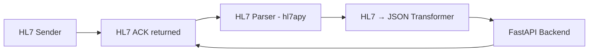

# Lyrebird HL7 Integration


A minimal HL7 v2.x integration service using TCP/MLLP.  
It receives HL7 messages, parses them, transforms them to JSON, forwards them to a REST API, and returns HL7-compliant ACK/NACK responses.

---

## TL;DR – Quick Start

```sh
# 1. Install dependencies
pip install -r requirements.txt

# 2. Start FastAPI backend
uvicorn app.api:app --reload

# 3. Start HL7 listener
python3 -m app.listener

# 4. Send an HL7 message
python3 -m app.sender
```

Check API health:
```sh
curl http://localhost:8000/health
# Expected: {"status":"ok"}
```

---


## Project Overview
**Goal**: Demonstrate core healthcare integration concepts:
- HL7 v2 message handling
- MLLP framing over TCP
- ACK/NACK generation
- HL7 → JSON transformation
- Downstream API forwarding


**Architecture Diagram:**



**Flow Summary**
1. TCP listener accepts connection and receives MLLP-framed HL7 messages. 
2. Messages are deframed and parsed with hl7apy. 
3. Parsed messages are transformed into JSON. 
4. JSON payload is POSTed to FastAPI REST API. 
5. Listener returns:
    - AA → Application Accept (success)
    - AE → Application Error (failure)

---

## Features

- **HL7 Listener:** TCP/MLLP server, supports multiple clients via threading. 
- **HL7 Parsing:** Uses [hl7apy](https://github.com/crs4/hl7apy) for  HL7 v2.x parsing.
- **MLLP Framing:** Handles partial/multiple messages per TCP packet. 
- **Robust Buffering:** Configurable buffer size and framing error limits. 
- **JSON Transformation:** Modular HL7 → JSON transformer.
- **Buffer Size & Framing Error Limits:** Enforces a buffer size limit (default: 1 MB) and limits repeated framing errors (default: 5) to prevent memory exhaustion or protocol abuse.
- **FastAPI Backend:** Example REST API endpoint for processed messages.
- **Idempotency Guard:** Thread-safe in-memory cache to prevent duplicate processing. 
- **Structured Logging:** Logs key metadata (timestamps, message_type, control_id, patient_id).
- **Error Handling:** Returns appropriate HL7 ACK/NACK responses.

---

## Project Structure

```
lyrebird-hl7-integration/
├── app/
│   ├── core/
│   │   ├── ack.py         # HL7 ACK builder
│   │   ├── mllp.py        # MLLP framing/deframing
│   │   └── config.py      # Configuration from .env
│   ├── services/
│   │   └── transformer.py # HL7 → JSON transformer
│   ├── api.py             # FastAPI backend
│   ├── listener.py        # HL7 TCP/MLLP listener
│   └── sender.py          # HL7 sender client
├── examples/
│   └── sample_adt_a01.hl7 # Example HL7 message
├── tests/                 # Unit and integration tests
├── .env                   # Environment configuration
└── README.md
```

---

## Requirements

- Python 3.8+
- [hl7apy](https://pypi.org/project/hl7apy/)
- [fastapi](https://fastapi.tiangolo.com/)
- [requests](https://pypi.org/project/requests/)
- [uvicorn](https://www.uvicorn.org/) (for running FastAPI)
- [python-dotenv](https://pypi.org/project/python-dotenv/) (for .env support)
- [httpx](https://www.python-httpx.org/)
- [python-json-logger](https://pypi.org/project/python-json-logger/)

Install dependencies:

```sh
pip install -r requirements.txt
```

---

## Environment Configuration

Create an .env file to override default settings:

```
HL7_HOST=0.0.0.0
HL7_PORT=2575
API_URL=http://localhost:8080/api/v1/messages
BUFFER_SIZE_LIMIT=1048576
MAX_FRAMING_ERRORS=5
MAX_RETRIES=3
RETRY_BACKOFF_BASE=0.5
IDEMPOTENCY_CACHE_SIZE=1000
API_TIMEOUT=5
```

---

## Usage

### 1. Start the FastAPI Backend

```sh
uvicorn app.api:app --reload
```
Default: http://localhost:8000

or 
```sh
uvicorn app.api:app --port 8080 --log-config logging_config.json
```
for valid JSON output. 


### 2. Health Check 

To verify the API is running and ready for monitoring, use:

```sh
curl http://localhost:8000/health
```

Expected response:
```json
{"status":"ok"}
```


### 3. Start HL7 Listener

```sh
python3 -m app.listener
```
Expected output:
```sh
Listening on 0.0.0.0:2575
```


### 4. Send HL7 Messages

```sh
python3 -m app.sender
```

Expected sender output:

```sh
Received ACK message:
MSH|^~\&|RecvApp|RecvFac|SendingApp|SendingFac|202603021200||ACK|123456|P|2.3
MSA|AA|123456
```

---

### Example HL7 Message

File `examples/sample_adt_a01.hl7`:

```
MSH|^~\&|SendingApp|SendingFacility|ReceivingApp|ReceivingFacility|202603021200||ADT^A01|123456|P|2.3
PID|1||MRN12345||Doe^John||19900101|M|||123 Main St^^City^ST^12345||555-1234
```

---

### Example JSON Output 

Example transformed payload:

```json
{
  "message_type": "ADT^A01",
  "message_control_id": "123456",
  "patient": {
    "mrn": "MRN12345",
    "first_name": "John",
    "last_name": "Doe",
    "dob": "19900101",
    "sex": "M"
  }
}
```

---

## Testing

All tests are located in the `tests/` directory. 

Run the full suite:
```sh
pytest -v
```

Run edge-case tests only:
```sh
pytest -m edge
```

Note: when running tests, make sure app and/or listener isnt being run elsewhere as it will interfere with current CI tests


Testing Highlights:
- **MLLP framing/deframing**
- **ACK/NACK correctness**
- **HL7 → JSON transformation**
- **Integration tests:** full roundtrip (sender → listener → API → ACK)
- **Edge cases:** large messages, malformed HL7, multiple messages in a single TCP packet
- **Concurrency & Idempotency:** multiple simultaneous clients, duplicate message handling

---

## Design Decisions

- **Concurrency:** Threaded TCP listener for simultaneous HL7 clients.
- **Idempotency:** In-memory cache; Redis supported for distributed deployments.
- **Streaming & Buffering:** Handles partial/multiple messages per TCP packet.
- **Structured Logging:** Logs timestamps, control_id, message_type, patient_id.
- **Extensibility:** Modular HL7 → JSON transformer for easy segment extension.

---

## Limitations

- **Idempotency is in-memory by default:** Will not survive process restarts or scale across multiple containers/instances unless Redis or another shared store is configured.
- **Minimal HL7 segment coverage:** Only core segments (e.g., MSH, PID) are parsed and transformed; additional segments require extension.
- **No TLS support:** All communication is currently unencrypted.
- **No Dockerfile or container orchestration provided by default.**
- **No message queue integration:** (e.g., Kafka, RabbitMQ) for downstream processing.
- **Minimal HL7 validation or schema enforcement.**

---

## Future Improvements

- **Persistent/Distributed Idempotency:** Use Redis (with SETNX + TTL) or another shared store for production-grade idempotency across restarts and multiple instances.
- **Full HL7 Segment Support:** Expand parsing and transformation to cover more HL7 segments and fields.
- **TLS/SSL Support:** Add encrypted transport for both listener and API.
- **Official Docker Support:** Provide Dockerfile and docker-compose for easy deployment and local development.
- **Message Queue Integration:** Add support for publishing messages to Kafka, RabbitMQ, or similar.
- **Advanced Validation:** Implement stricter HL7 validation and schema enforcement.
- **Enhanced Observability:** Integrate with centralized logging and monitoring solutions (e.g., ELK, Prometheus).
- **Horizontal Scalability:** Support for running multiple listener/API instances behind a load balancer.

---

## Error Handling

- Invalid MLLP framing → returns AE
- Parsing failure → returns AE
- API failure → returns AE
- Successful processing → returns AA

Errors are logged for observability.

---

*See `tests/` for implementation details and expand as needed for your use case!*

---

## License

This project is licensed under the MIT License.  
See the [LICENSE](LICENSE) file for details.

